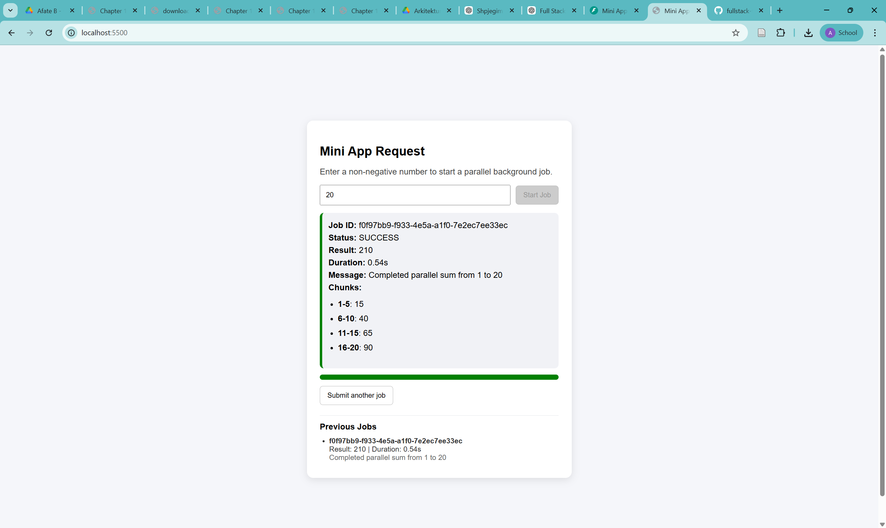
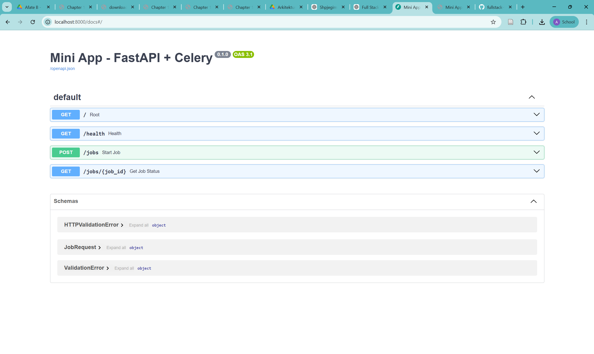

# Mini App Request – FastAPI + Celery + Frontend + Docker Compose

A full-stack demo application for distributed background computation using FastAPI, Celery, Redis, and a lightweight frontend.

This application allows users to submit a number, processes it in parallel using Celery workers, and displays real-time progress and results in a clean UI.

---

## 📸 Screenshots

### UI


### API Docs


---

## 🚀 Features

- FastAPI REST API
- Celery background job processing
- Redis as broker and result backend
- Parallel computation using chunked tasks
- Job status polling by ID
- Real-time frontend updates
- Progress bar with loading state
- Chunk-level result breakdown
- Execution time tracking
- Job history tracking (UI)
- Docker Compose setup
- Automated API tests with pytest

---

## 🧠 Architecture

Frontend → FastAPI → Celery → Redis → Worker(s)

### Flow

1. User submits a number via frontend
2. FastAPI creates a background job
3. Task is split into chunks
4. Each chunk runs in parallel (Celery workers)
5. Results are aggregated
6. Frontend polls job status
7. Final result + breakdown displayed

---

## 🛠 Tech Stack

- **Backend:** FastAPI
- **Task Queue:** Celery
- **Broker:** Redis
- **Frontend:** HTML, CSS, JavaScript
- **Containerization:** Docker + Docker Compose
- **Testing:** pytest

---

## 📁 Project Structure

```
fullstack-takehome/
├── app/
│   ├── celery_app.py
│   ├── main.py
│   ├── models.py
│   ├── tasks.py
│   └── requirements.txt
├── frontend/
│   └── index.html
├── tests/
│   └── test_api.py
├── docker-compose.yml
├── Dockerfile
├── README.md
├── answers.md
└── .gitignore
```

---

## 🔌 API Endpoints

### `GET /`
```json
{ "message": "API is running" }
```

---

### `GET /health`
```json
{ "status": "ok" }
```

---

### `POST /jobs`

**Request:**
```json
{ "number": 100 }
```

**Response:**
```json
{
  "job_id": "uuid",
  "status": "PENDING",
  "message": "Parallel job created successfully"
}
```

---

### `GET /jobs/{job_id}`

**Example Response:**
```json
{
  "job_id": "uuid",
  "status": "SUCCESS",
  "result": {
    "input": 100,
    "result": 5050,
    "chunks": [
      { "start": 1, "end": 25, "partial_sum": 325 },
      { "start": 26, "end": 50, "partial_sum": 950 },
      { "start": 51, "end": 75, "partial_sum": 1575 },
      { "start": 76, "end": 100, "partial_sum": 2200 }
    ],
    "chunk_count": 4,
    "duration": 2.57,
    "message": "Completed parallel sum from 1 to 100"
  }
}
```

---

## ⚙️ Parallel Processing

The number is split into chunks and processed in parallel.

Example for `100`:

- 1–25
- 26–50
- 51–75
- 76–100

Each chunk runs as a separate Celery task and results are aggregated.

---

## 🐳 Run with Docker

### Prerequisites

- Docker Desktop installed

---

### Start everything

```bash
docker compose up --build
```

---

### Access Services

- API: http://localhost:8000
- Swagger Docs: http://localhost:8000/docs
- Frontend: http://localhost:5500

---

## 🌐 Run Frontend (manual)

```bash
cd frontend
python -m http.server 5500
```

---

## 🧪 Run Tests

```bash
pytest -v
```

---

## 🎨 Frontend Features

- Input validation
- Loading spinner
- Progress bar
- Success / error UI
- Duration display
- Chunk breakdown
- Job history
- Retry button

---

## ⚖️ Design Decisions

- FastAPI for performance and simplicity
- Celery + Redis for async distributed tasks
- Polling over WebSockets (simpler implementation)
- Lightweight frontend to emphasize backend architecture

---

## 🛡 Validation & Error Handling

- Frontend validates input before sending
- Backend validates input again
- Clear error messages returned via API
- UI reflects job state (pending, success, failure)

---

## 🔮 Possible Improvements

- Add database (PostgreSQL)
- Replace polling with WebSockets
- Add authentication (JWT)
- Add Celery monitoring (Flower)
- Add integration tests
- Build modern frontend (React)

---

## 📸 Screenshot

_Add your screenshot here:_

```
assets/ui.png
```

```markdown

```

---

## 📄 Concept Questions

Answers are included in:

```
answers.md
```

---

## 👨‍💻 Author

Full Stack Developer Take-home Assignment
